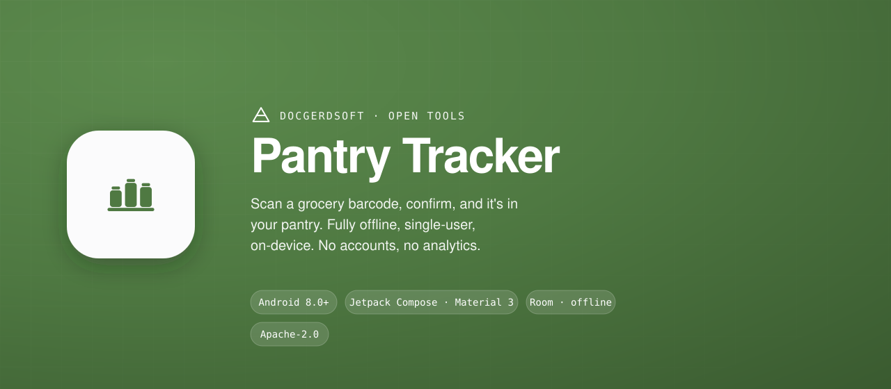
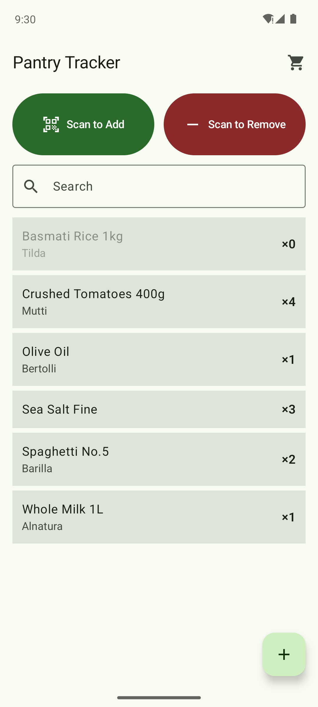
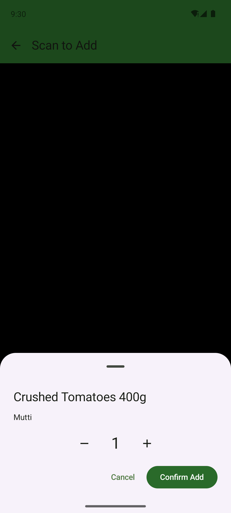
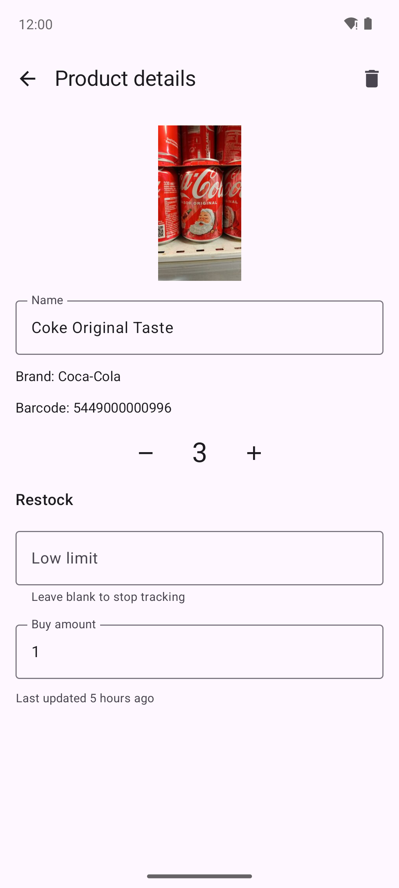

# Pantry Tracker

<!--
  Hero banner (vector stopgap). Recommended export: render docs/brand/hero.svg
  (or the brand-doc `.readme-hero` HTML at 2x) to docs/brand/hero.png at
  2560x1120 and swap the src below to the PNG for a crisp GitHub
  social-preview / Open Graph card. DEFERRED to the maintainer.
-->


[](https://github.com/DocGerd/pantry-tracker/actions/workflows/ci.yml)
[](https://github.com/DocGerd/pantry-tracker/actions/workflows/codeql.yml)
[](https://codecov.io/gh/DocGerd/pantry-tracker)
[](https://scorecard.dev/viewer/?uri=github.com/DocGerd/pantry-tracker)
[](https://www.bestpractices.dev/projects/13017)
[](LICENSE)

A single-user Android app for tracking what's in your kitchen pantry. Point the
phone at a product barcode, the app resolves it against
[Open Food Facts](https://world.openfoodfacts.org) (and its sister databases for
cosmetics, pet food, and general products), and a confirm tap adds the item to a
local, on-device inventory. Browse, search, edit quantities, and remove items —
all of it stored in a local Room/SQLite database that works fully offline. The
only network call the app ever makes is the anonymous barcode lookup; there are
no accounts, no analytics, and no crash reporter.

## Scope / Status

- **v1.0.0** (2026-05-18) through **v1.3.1** (2026-05-29) have shipped as **signed
  sideload APKs** on [GitHub Releases](https://github.com/DocGerd/pantry-tracker/releases).
  There is no Play Store or F-Droid presence — distribution is sideload-only.
- The current release is **[v1.3.1](https://github.com/DocGerd/pantry-tracker/releases/latest)**.
  See [`CHANGELOG.md`](CHANGELOG.md) for the per-version detail and the `Unreleased`
  section for what's queued.

What the app does (and deliberately does **not** do) is set out in the arc42
docs — start with [§1 Introduction and Goals](docs/architecture/01-introduction-and-goals.md)
and [§3 System Scope and Context](docs/architecture/03-system-scope-and-context.md).
Non-goals include multi-user sync, shopping lists, recipe planning, and
expiry-date tracking.

See [ROADMAP.md](ROADMAP.md) for direction and explicit non-goals.

## Screenshots

> Captured on a Pixel 6 emulator (API 34), light theme.

| Home | Scan | Detail |
|:---:|:---:|:---:|
|  |  |  |

- **Home** — your pantry at a glance: search, browse, and tap an item to edit it. Scan-to-add (green) / scan-to-remove (red) up top, a buying-list cart, and out-of-stock items greyed out.
- **Scan** — point the camera at a barcode; Pantry Tracker resolves it (from your pantry or via Open Food Facts) and a confirm tap adds or removes it.
- **Detail** — adjust the quantity, set an optional low-stock limit + buy amount for the buying list, view the product image, or delete the item.

## Install

Pantry Tracker is distributed as a **signed APK** on
[GitHub Releases](https://github.com/DocGerd/pantry-tracker/releases) — sideload
it onto your device.

- **Minimum Android version:** 8.0 (API 26).
- **Target Android version:** 16 (API 36).

Download the `app-release.apk` asset from the latest release and install it
(you may need to allow "install from unknown sources" for your browser or file
manager). The full release-and-install procedure, including the signing-cert
identity that all v1.0.x updates share, is in
[`docs/release/SHIPPING.md`](docs/release/SHIPPING.md).

Verify a downloaded APK before installing — see [SHIPPING.md §Verifying a release APK signature](docs/release/SHIPPING.md).

## Build

The project builds with the Gradle wrapper. You need **JDK 21** and an Android
SDK with API 36 platform + build tools installed.

```bash
./gradlew :app:assembleDebug        # debug APK (auto-signed with the debug keystore)
./gradlew :app:test                 # JVM unit tests (JUnit 4, Robolectric, Turbine)
./gradlew :app:detekt               # Kotlin static analysis (CI gates on this)
./gradlew :app:lint                 # Android Lint
```

A release build (`./gradlew :app:assembleRelease`) additionally needs four
keystore properties; see [`docs/release/SHIPPING.md`](docs/release/SHIPPING.md)
§B. Without them the release task produces an *unsigned* APK that cannot be
installed (useful only for build-size checks).

## Tech stack

| Layer | Technology |
|---|---|
| Language | Kotlin |
| UI | Jetpack Compose + Material 3 + Navigation Compose |
| Persistence | Room over SQLite (KSP-generated DAOs) |
| Networking | Ktor client (OkHttp engine) + kotlinx.serialization, against Open Food Facts |
| Camera + scanning | CameraX + Google ML Kit barcode-scanning (EAN-13/EAN-8/UPC-A/UPC-E) |
| Image loading | Coil 3 |
| Dependency injection | **Manual constructor wiring** (`AppContainer`) — no Hilt |
| Concurrency | kotlinx-coroutines |

Single `:app` module, application id `de.docgerdsoft.pantrytracker`. The full
list of what ships in the APK is in
[arc42 §3.3](docs/architecture/03-system-scope-and-context.md).

## Documentation

Documentation is **markdown-in-repo, rendered by GitHub** (no separate docs site —
see [ADR-0007](docs/adr/0007-keep-documentation-markdown-in-repo.md)). Start at the
**[documentation index](docs/README.md)** for a map and reading order.

- [`docs/README.md`](docs/README.md) — the docs index: reading order across the tree.
- [`docs/architecture/`](docs/architecture/) — arc42 architecture docs covering all
  standard sections (with GitHub-rendered Mermaid diagrams); read §1 and §3 first.
- [`docs/adr/`](docs/adr/) — Architecture Decision Records (the numbered ADRs).
- [`docs/security-posture.md`](docs/security-posture.md) — the living security
  overview; [`SECURITY.md`](SECURITY.md) is how to report a vulnerability (privately).
- [`docs/release/SHIPPING.md`](docs/release/SHIPPING.md) — the release runbook.
- [`CHANGELOG.md`](CHANGELOG.md) — per-release notes (Keep a Changelog format).
- [`CONTRIBUTING.md`](CONTRIBUTING.md) — how to contribute: the GitFlow
  workflow, branch naming, the review process, and the source-header convention.
- [`GOVERNANCE.md`](GOVERNANCE.md) — the decision-making model (single-maintainer,
  GitFlow, only-humans-merge-to-`develop`-and-`main`).
- [`CODE_OF_CONDUCT.md`](CODE_OF_CONDUCT.md) — Contributor Covenant.
- [`CLAUDE.md`](CLAUDE.md) — the operational guide (workflow, tooling,
  project-local config), not the architectural canon.

## License

Licensed under the [Apache License 2.0](LICENSE).

Product data is from [Open Food Facts](https://world.openfoodfacts.org) (Open
Database License); barcode decoding uses
[Google ML Kit](https://developers.google.com/ml-kit/vision/barcode-scanning).
