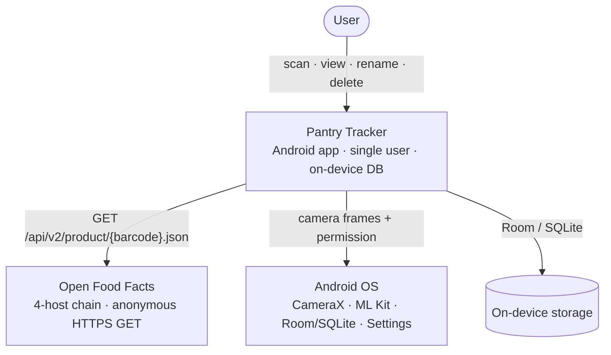

# 3. System Scope and Context

## 3.1 Business context

*OFF here is the project family: a lookup walks `world.openfoodfacts.org`
→ Open Beauty Facts → Open Pet Food Facts → Open Products Facts on `404`,
failing fast on any other error. See §8.9 for the full host list and chain
rules.*

### External actors

| Actor | Direction | Purpose | Failure mode |
|-------|-----------|---------|--------------|
| **User** | input | scan, browse, edit | n/a (single user, single device) |
| **Open Food Facts (+ 3 sister projects)** | outbound HTTPS | resolve barcode → product name/brand/image URL, walking up to four hosts on `404` (Food → Beauty → PetFood → Products) | Any non-`404` failure (5xx, timeout, network down) on a host short-circuits the chain and is treated as **miss** → drop to manual entry. All-four-`404` is also a miss. No retry. |
| **Android camera + ML Kit** | inbound (frames + decoded values) | barcode decoding from camera preview | `MlKitException.MODEL_HASH_MISMATCH` (corrupt model on disk) surfaces as a permanent error; `UNAVAILABLE` is treated as transient (model still downloading from Play Services). |
| **Android Settings activity** | outbound intent | recovery from "don't ask again" camera-permission denial | `ActivityNotFoundException` (locked-down devices) → Toast fallback. |

### Out of scope

- No backend service of our own (no auth, no sync, no telemetry).
- No alternative product database (only the OFF project family — food + cosmetics + pet food + general products).
- No multi-user state.
- No background work — all I/O is foreground, driven by a user gesture.

## 3.2 Technical context

| Touchpoint | Protocol | Notes |
|------------|----------|-------|
| OFF API | HTTPS GET, JSON response | 8 s timeout (connect/read/write), Ktor + OkHttp engine, `User-Agent: PantryTracker/<ver> (<repo URL>)`. Only the path `/api/v2/product/<barcode>.json` is used, against up to four hosts (`world.openfoodfacts.org` → `world.openbeautyfacts.org` → `world.openpetfoodfacts.org` → `world.openproductsfacts.org`) as a `404`-only fallback chain. |
| Camera | CameraX preview + ImageAnalysis on a dedicated `Executors.newSingleThreadExecutor()` | Back camera only (`CameraSelector.DEFAULT_BACK_CAMERA`); single-frame KEEP_ONLY_LATEST backpressure. |
| Barcode decoding | ML Kit on-device | Formats restricted to EAN-13/EAN-8/UPC-A/UPC-E. |
| Local persistence | Room over SQLite | Single database file `pantry-tracker.db`. One table (`products`) with a unique index on `barcode`. |
| Image cache | Coil 3, OkHttp fetcher | OFF product photos cached on disk by URL. |
| App settings deep-link | `Settings.ACTION_APPLICATION_DETAILS_SETTINGS` intent | Used only by the HardDenied camera-permission recovery path. |

## 3.3 What ships in the APK

| Layer | Library family |
|-------|----------------|
| UI | Compose UI + Material 3 + Material icons extended + Navigation Compose |
| Lifecycle | androidx.lifecycle (runtime, viewmodel, process) |
| Camera + scanning | androidx.camera (camera2, lifecycle, view) + Google ML Kit barcode-scanning |
| HTTP | Ktor client (core + okhttp + content-negotiation + logging) + kotlinx.serialization |
| Image loading | Coil 3 (compose + network/okhttp) |
| Persistence | androidx.room (runtime + ktx; KSP-generated DAOs) |
| Concurrency / time | kotlinx-coroutines (android) + kotlinx-datetime |

No code from outside these is on the runtime classpath. The dependency lockfile
(`app/gradle.lockfile`) pins exact versions and is scanned by OSV in CI.
