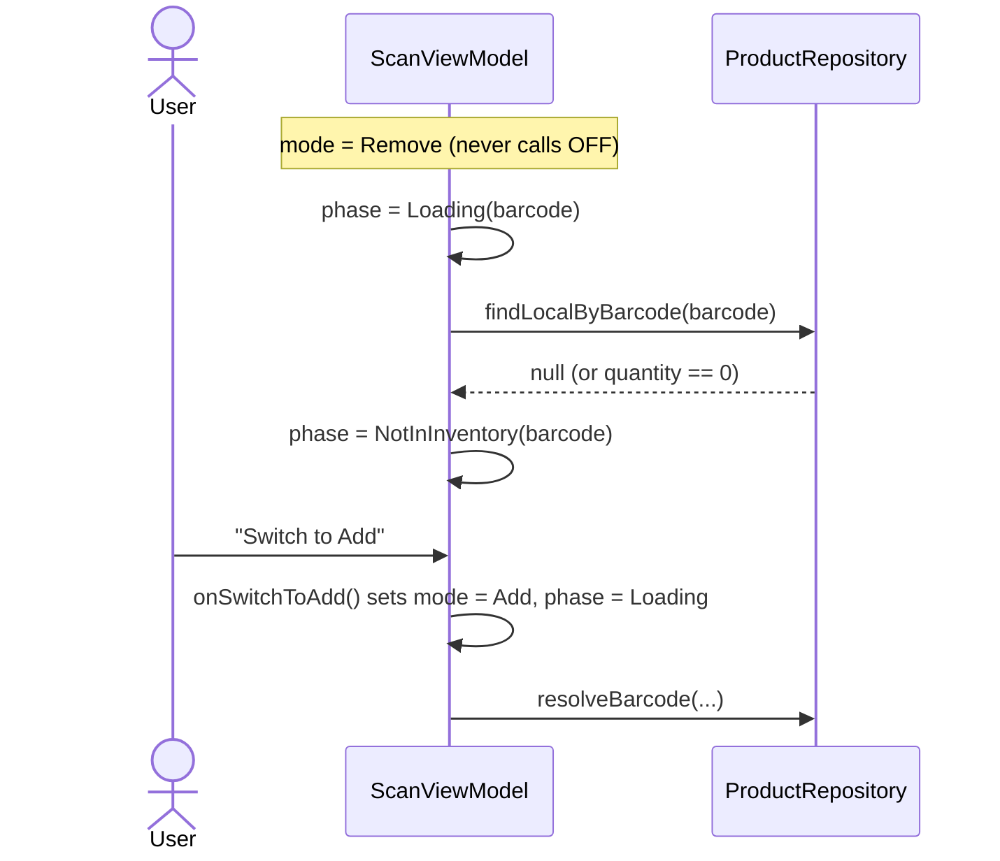
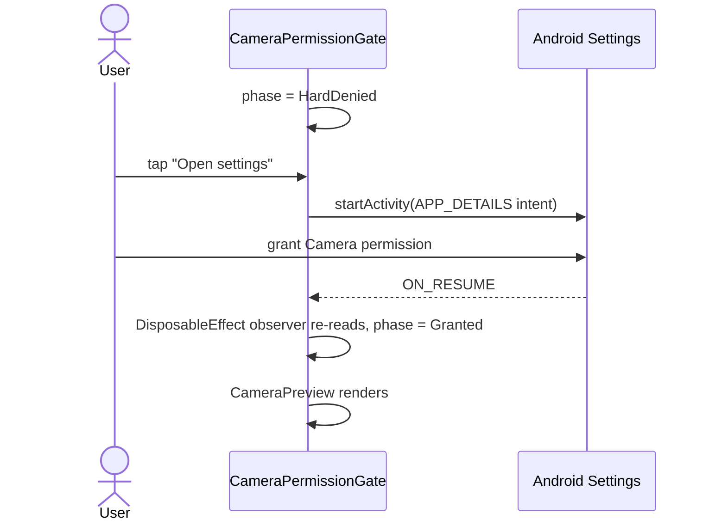
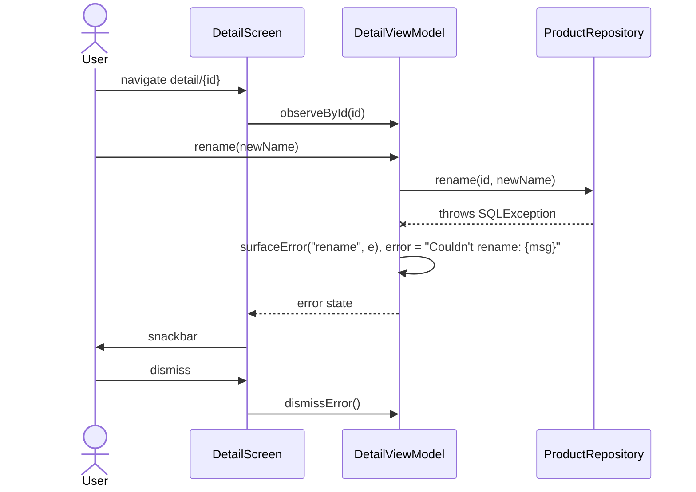
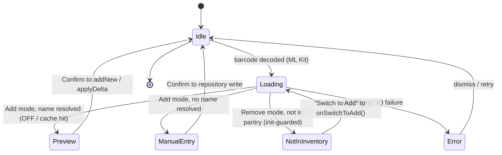

# 6. Runtime View

Four scenarios cover most of the app's behaviour; the rest follow the same
patterns. §6.5 distils the scan-phase state machine those scenarios traverse.

## 6.1 Scenario — Scan to add a product, OFF hit

```mermaid
sequenceDiagram
    actor User
    participant CP as CameraPreview
    participant VM as ScanViewModel
    participant Repo as ProductRepository
    participant OFF
    User->>CP: grant camera permission
    CP->>VM: barcode decoded (ML Kit)
    VM->>VM: phase = Loading(barcode)
    VM->>Repo: lookupForPreview(barcode)
    Repo->>Repo: findByBarcode returns null
    Note over Repo,OFF: 30-day cache hit elides the OFF call
    Repo->>OFF: GET /api/v2/product/{barcode}.json
    OFF-->>Repo: 200 OK
    Repo-->>VM: ScanCandidate.FromOff(name)
    VM->>VM: phase = Preview(candidate)
    User->>VM: Confirm
    VM->>Repo: addNew(...)
    VM->>VM: phase = Idle
```

Key invariants:
- `lookupJob`, `confirmJob`, `manualEntryJob` are tracked separately and
  cancelled when a new barcode arrives or the user dismisses the sheet —
  prevents stale results clobbering a fresh phase.
- Each post-async state write checks "do I still own this phase?" before
  applying. Two flavors of the guard exist:
  - **`confirm()` and `submitManualEntry()`** use *referential equality*:
    `if (s.phase === phase) s.copy(phase = newPhase) else s`. They have a
    specific old phase instance (the one being acted on) and verify it's
    still current.
  - **`resolveBarcode()`** uses *barcode equality on the Loading phase*:
    `(state.phase as? Phase.Loading)?.barcode == barcode`. It doesn't
    have a captured phase reference because the launch happens before
    the post-write, so it matches on the barcode value instead.
  Both prevent races where an in-flight result overwrites a fresh phase;
  pick the right one when adding a new async op.
- `CancellationException` is rethrown in every `catch` before the generic
  `catch (Exception)` branch — otherwise structured concurrency breaks and
  the cancel-then-write cleanup races.

The diagram above shows the `FromOff → addNew(...)` branch (a barcode the
local DB has never seen). For a re-scan of a barcode that IS in the local
DB, `confirm()` takes the **Persisted → applyDelta** path instead
(`ScanViewModel.kt:144`): same loading/preview/confirm sequence, but the
final repository call is `applyDelta(productId, pendingQuantity)` rather
than `addNew(...)`. In both cases the post-call transition is the same
`Phase.Idle`.

Cache short-circuit: when `findLocalByBarcode` misses, the repository
consults `OffLookupCacheDao.findByBarcode` before calling `OFF.lookup`.
A fresh cache hit (≤ 30 days old) skips the network entirely; the OFF
arrow in the diagram is elided and `FromOff(...)` is constructed from
the cached row. On confirm, the cache row for that barcode is deleted
(`addNew(...)` does the eviction) so the product lives in `products`
only.

## 6.2 Scenario — Scan to remove, item not in inventory



Note: Remove mode does NOT call OFF. A local miss is unambiguously "nothing
to remove" — we don't enrich something the user doesn't have.

Also: a local hit at `quantity == 0` is also routed to `NotInInventory` (not
`Preview`), because there is nothing to decrement. The user's affordance is
the same: "Switch to Add" → goes through the add flow.

## 6.3 Scenario — Camera-permission settings round-trip recovery

This scenario exists because the M6 PR review caught a regression in an
earlier version of the gate, where this flow ended in a deadlock.



The DisposableEffect that wires the `Lifecycle.Event.ON_RESUME` observer
is the load-bearing piece — without it the gate stays in `HardDenied`
after the user grants permission in Settings, leaving them stuck on the
"Open settings" screen even though they did everything right.

## 6.4 Scenario — Detail screen rename, repository throws



`surfaceError` in `DetailViewModel:89-93` is the canonical template that
the M6 audit normalized other catch sites against.

## 6.5 Scan phase state machine

`ScanViewModel` exposes a `ScanUiState` whose `phase` is a `ScanUiState.Phase`
sealed interface (six members). The transitions across the scenarios above:



`Phase.Error` carries a `UiText` message (i18n, #218); `Phase.NotInInventory` is
**Remove-mode only**, enforced by an `init { require(...) }` block in
`ScanUiState`. A local hit at `quantity == 0` also routes to `NotInInventory`
(nothing to decrement).
